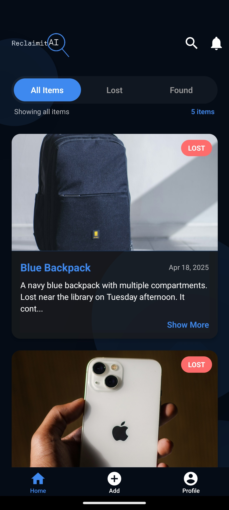
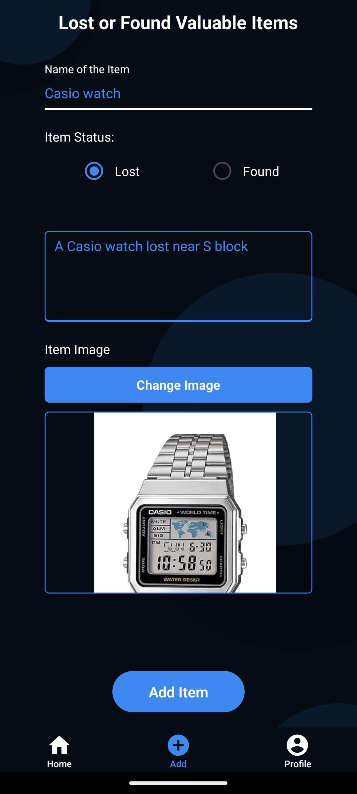

# ReclaimitAI Frontend (React Native)

> 🔗 **You can explore the backend here:** [ReclaimitAI Backend Repository](https://github.com/GuthaPrathyush/ReclaimitAI-backend)

## Demo

## Home screen

## Form screen

## 📱 Built With

- ⚛️ React Native (Expo)
- 🧠 Integration with AI APIs (BERT/CLIP) via backend
- 🧾 Axios for API communication
- 🔐 Secure login and registration screens
- 📸 Image picker and upload functionality

## 🚀 Getting Started

### Prerequisites

- [Node.js](https://nodejs.org/)
- [Expo CLI](https://docs.expo.dev/get-started/installation/)
- Access to the backend API (FastAPI)